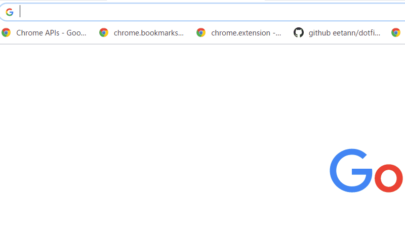

# Mr.Sagasu
This is a Chrome Extension to search bookmark in the address bar.
<!--  -->  
<!-- OverviewOverviewOverview -->  

## Features
***DEMO:***  
  

- search to only titles of bookmarks at the address bar
- **fuzzy match** = All you have to do is type a few characters

  
For example,
let's say titles of bookmarks are the following.

- bookmaaark abc
- booookmaaaaark def
- boooookmaark ghi
- goooookmaark

When you want to choice "boooookmaark ghi", All you have to do is type "bg".  
It's brought by fuzzy match like the following.  
**b**oooookmaark **g**hi  

## Usage

1. move at the address bar
2. type "b" and space key
3. type a few characters
4. choice a suggest by using arrow keys and enter key

<!-- ## Installation -->

## Author
[@eetann092](https://twitter.com/eetann092)  

<!-- ## License                           -->  
<!-- [MIT](http://eetann.mit-license.org) -->  
