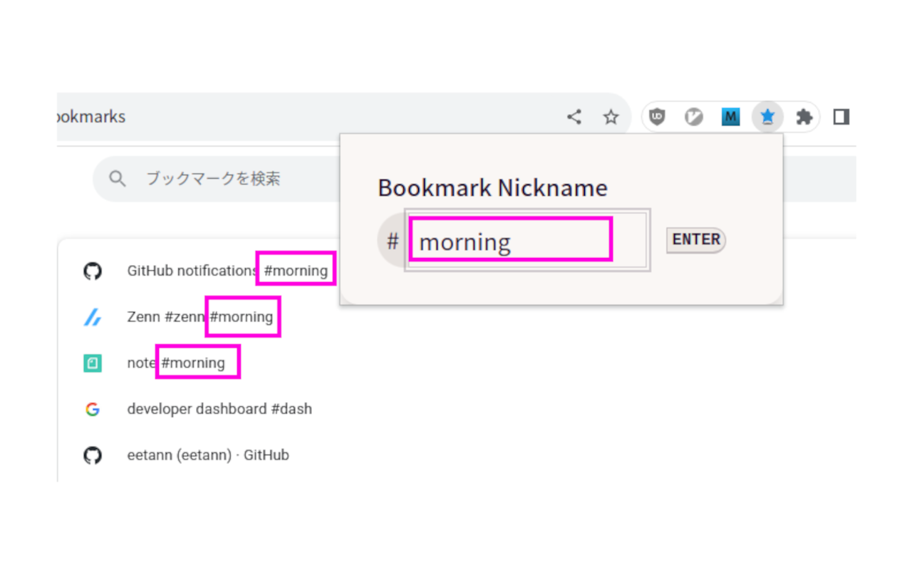
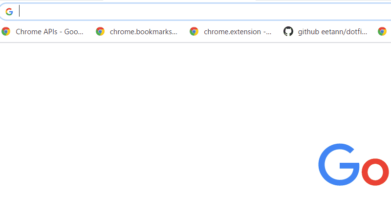

  

# Mr.Sagasu
This is a Chrome Extension to search bookmark.
[Mr.Sagasu](https://chrome.google.com/webstore/detail/mrsagasu/kkendaacffjgfnjaolejgaopcoakacpb)

## Features
### Bookmark Nickname
Open bookmarks with hashtags at once

0. Add hashtag to the title of bookmark

1. Enter key bindings(default Ctrl + Shift + Y)
2. Enter hashtags on the popup screen
3. Press Enter key or Enter button on the screen

### Search titles of bookmarks at the address bar
- search to only titles of bookmarks at the address bar
- **fuzzy match** = All you have to do is type a few characters

  

  
For example,
let's say titles of bookmarks are the following.

- bookmaaark abc
- booookmaaaaark def
- boooookmaark ghi
- goooookmaark

When you want to choice "boooookmaark ghi", All you have to do is type "bg".  
It's brought by fuzzy match like the following.  
**b**oooookmaark **g**hi  

1. Move at the address bar
2. Type "b" and space key
3. Type a few characters
4. Choice a suggest by using arrow keys and enter key

## Author
[@eetann092](https://twitter.com/eetann092)  
